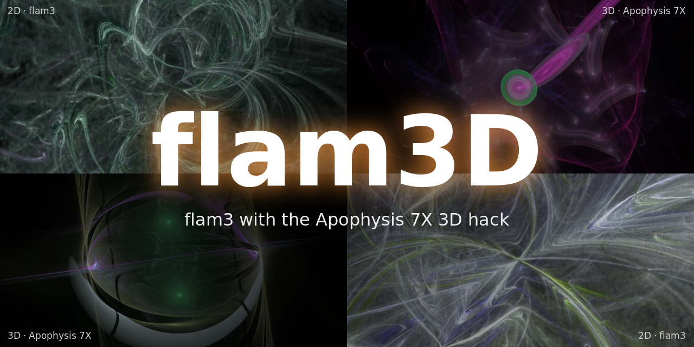

# flam3D



flam3D is [flam3](https://github.com/scottdraves/flam3) with the Apophysis 7X
"3D hack" added, so it renders the 3D flames of Apophysis 7X as well as
classic 2D flames. It adds:

- a z coordinate and the 3D camera (`cam_pitch`, `cam_yaw`,
  `cam_perspective`, `cam_zpos`, `cam_dof`)
- Apophysis' pre_/post_ variation ordering and `var_color`
- the 34 built-in 3D variations of Apophysis 7X, the 18 3D variations of its
  plugin pack, and the circlize, Spherical3D, scry_3D and zeta3D plugins
- Apophysis' handling of xaos dead ends (an xform whose links to all xforms
  are 0 ends the batch of iterations instead of aborting the render)

Flames without 3D features render exactly as with unpatched flam3. See the
"3D hack" section of `README.txt` for the full list of variations and
parameters.

Apophysis changed the 3D behaviour in 7X 15C: since then the 2D variations
(spherical, polar, julian, ...) pass z through and `linear` is 3D, while older
versions keep z only in the explicitly 3D variations and call the 3D linear
`linear3D`. flam3D picks the older behaviour from the flame's `version`
attribute (Apophysis 2.x, 7X.14 and earlier, 7X 15B and earlier) and the
newer one for everything else; `apo_pre15c="1"` or `"0"` on the `<flame>`
element overrides it, and flam3-genome writes it out so the setting survives.

## Building on Linux

Install the development packages (Debian/Ubuntu names shown), then unpack the
release archive and build:

```
sudo apt install build-essential libxml2-dev libjpeg-dev libpng-dev zlib1g-dev
tar xzf flam3D-1.0.tar.gz
cd flam3D-1.0
./configure
make
```

If you edit any `.h` file later, run `make clean` before `make`, because
header changes are not tracked.

The binaries (`flam3-render`, `flam3-animate`, `flam3-genome`,
`flam3-convert`) are built in place. Distributions often ship the unpatched
flam3 (Ubuntu's `flam3-utils` puts it in `/usr/bin`), so either
`sudo make install` or run the flam3D binaries by path. Without
`make install`, point flam3D at its palettes or numbered palettes render white:

```
export flam3_palettes=$PWD/flam3-palettes.xml
```

### Building from the patch instead

flam3D is also available as a patch against upstream flam3
(`flam3-3d-hack.patch`):

```
git clone --depth 1 https://github.com/scottdraves/flam3
cd flam3
patch -p1 < ../flam3-3d-hack.patch
touch aclocal.m4; sleep 1; touch configure Makefile.in config.h.in; sleep 1
./configure
make
```

The `touch` line keeps `make` from trying to regenerate the autotools files of
a git checkout, which needs automake 1.15. The release archive does not need
it. The patch does not contain the title image of this README.

## Building on a Raspberry Pi (5, 400, 2B)

The steps are the same on all three models; only the optional CPU flag differs.

### 1. Install build tools and libraries

```
sudo apt update
sudo apt install -y build-essential libxml2-dev libjpeg-dev libpng-dev zlib1g-dev
```

Check whether the OS is 64- or 32-bit (the CPU flag in step 3 depends on it):

```
uname -m        # aarch64 = 64-bit, armv7l = 32-bit
```

### 2. Unpack the source

Copy the release archive to the Pi (for example
`scp flam3D-1.0.tar.gz pi@<pi-address>:~`), then on the Pi:

```
tar xzf flam3D-1.0.tar.gz
cd flam3D-1.0
```

Unpack the archive rather than copying a source tree that was already built
on another machine (it contains that machine's build files).

### 3. Configure and build

Configure with the line for your board. The `-mcpu` flag is optional; it adds
CPU-specific tuning on top of flam3's own `-O3 -ffast-math`.

| Board / OS | Configure command |
|---|---|
| Pi 5, 64-bit | `./configure CFLAGS="-mcpu=cortex-a76"` |
| Pi 400, 64-bit | `./configure CFLAGS="-mcpu=cortex-a72"` |
| Pi 400, 32-bit | `./configure CFLAGS="-mcpu=cortex-a72 -mfpu=neon-fp-armv8 -mfloat-abi=hard"` |
| Pi 2B v1.1 (32-bit) | `./configure CFLAGS="-mcpu=cortex-a7 -mfpu=neon-vfpv4 -mfloat-abi=hard"` |
| Pi 2B v1.2 (32-bit) | `./configure CFLAGS="-mcpu=cortex-a53 -mfpu=neon-fp-armv8 -mfloat-abi=hard"` |

To tell the Pi 2B revisions apart, run `grep -m1 "CPU part" /proc/cpuinfo`:
`0xc07` is a Cortex-A7 (v1.1), `0xd03` is a Cortex-A53 (v1.2). Plain
`./configure` without flags works on every model too.

Build:

```
make -j4
```

On the 1 GB Pi 2B use `make -j2` to avoid running out of memory while
compiling. Expect roughly 1 minute on a Pi 5, 2–3 minutes on a Pi 400 and about
10 minutes on a Pi 2B. If you edit any `.h` file later, run `make clean` before
`make`, because header changes are not tracked.

### 4. Test

```
env flam3_palettes=$PWD/flam3-palettes.xml qs=0.3 in=test3d.flam3 ./flam3-render
```

This should write `00000.png` and `00001.png` with no "unrecognized variation"
warnings.

### 5. Use it

Either install system-wide:

```
sudo make install
```

or keep it local and put it first on your `PATH`, so a distro `flam3-utils`
package cannot be picked up by mistake:

```
echo 'export PATH=$HOME/flam3D-1.0:$PATH' >> ~/.bashrc
echo 'export flam3_palettes=$HOME/flam3D-1.0/flam3-palettes.xml' >> ~/.bashrc
source ~/.bashrc
which flam3-render    # should print /home/<user>/flam3D-1.0/flam3-render
```

With `make install` the palette file is found automatically, so
`flam3_palettes` is only needed for the local option.

### Performance tips

- **Threads:** flam3 uses all cores automatically; `nthreads=N` overrides it.
- **Pi 2B and other low-memory systems:** split big renders with `nstrips=4`
  (flam3-render only), or cap memory with `use_mem=` (in bytes). Keep `quality`
  and size modest.
- **Cooling:** a Pi 5 throttles under long renders without a heatsink or fan;
  the active cooler is worth it for animations.
- **dc_image:** set `flam3_dc_images=/path/to/bmp/folder` if your flames use it.
